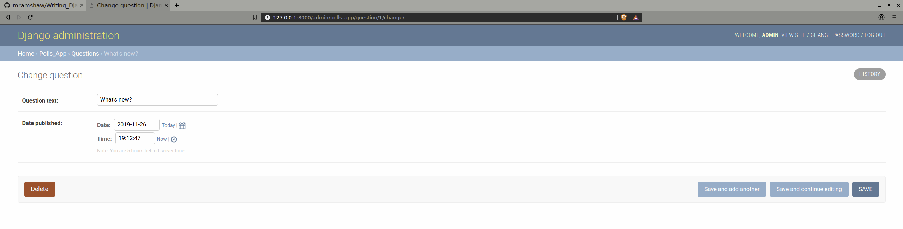
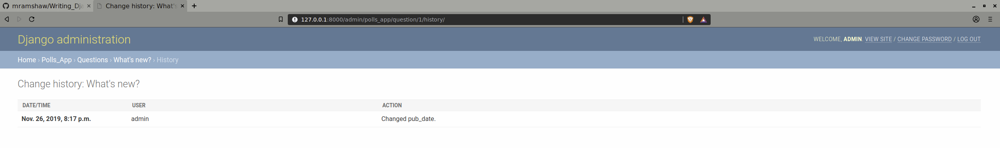

# Writing Django 2

Having investigated [Django 1 with Python 2](http://github.com/mramshaw/Writing_Django) it seemed
time to investigate Django __2__ with Python __3__, mainly because Python 2 support ends in 2020.

[As my initial exercise was pretty straightforward, rather than try to update that repo, I will
 simply recreate the whole exercise with Django 2 and Python 3. For more details, please refer to
 the original repo.]

## Django LTS

Note that we will use the __LTS__ version of Django 2, which at the time of writing (November 2019)
is __2.2.7__.

This release requires Python [3.5 or more recent](http://docs.djangoproject.com/en/2.2/faq/install/#faq-python-version-support).

## Python 3

Verify the version of Python as follows:

```bash
$ python3 --version
Python 3.5.2
$
```

[I have both Python 2 and Python 3 installed. On my system, Python 2 is <kbd>python</kbd>
 while Python 3 is <kbd>python3</kbd>. Likewise Python 2 uses <kbd>pip</kbd> while Python 3
 uses <kbd>pip3</kbd> In the instructions that follows I will use <kbd>python3</kbd> and
 <kbd>pip3</kbd> but these may be replaced with <kbd>python</kbd> and <kbd>pip</kbd> for
 systems where only Python 3 is installed.]

## Prerequisites

Install the latest version of Django (plus dependencies) as follows:

    $ pip3 install --user -r requirements.txt

Verify the installed version of Django as follows:

```bash
$ python3 -m django --version
2.2.7
$
```

## Create a Project

Use the <kbd>django-admin</kbd> command to do this:

    $ django-admin startproject polls

And time to see if everything works so far:

    $ cd polls
    $ python3 manage.py runserver

The results should be something like:

```bash
$ python3 manage.py runserver
Watching for file changes with StatReloader
Performing system checks...

System check identified no issues (0 silenced).

You have 17 unapplied migration(s). Your project may not work properly until you apply the migrations for app(s): admin, auth, contenttypes, sessions.
Run 'python manage.py migrate' to apply them.

November 26, 2019 - 16:48:54
Django version 2.2.7, using settings 'polls.settings'
Starting development server at http://127.0.0.1:8000/
Quit the server with CONTROL-C.
[26/Nov/2019 16:49:27] "GET / HTTP/1.1" 200 16348
[26/Nov/2019 16:49:28] "GET /static/admin/css/fonts.css HTTP/1.1" 200 423
[26/Nov/2019 16:49:28] "GET /static/admin/fonts/Roboto-Bold-webfont.woff HTTP/1.1" 200 86184
[26/Nov/2019 16:49:28] "GET /static/admin/fonts/Roboto-Regular-webfont.woff HTTP/1.1" 200 85876
[26/Nov/2019 16:49:28] "GET /static/admin/fonts/Roboto-Light-webfont.woff HTTP/1.1" 200 85692
Not Found: /favicon.ico
[26/Nov/2019 16:49:28] "GET /favicon.ico HTTP/1.1" 404 1971
^C$
```

The development server at http://127.0.0.1:8000/ should look something like:


## Create an App

This needs to be done in the folder where `manage.py` lives:

    $ python3 manage.py startapp polls_app

## Create a View

Open `polls_app/views.py` and change it as follows:

```bash
$ git diff polls_app/views.py
diff --git a/polls/polls_app/views.py b/polls/polls_app/views.py
index 91ea44a..d2dfb9f 100644
--- a/polls/polls_app/views.py
+++ b/polls/polls_app/views.py
@@ -1,3 +1,7 @@
 from django.shortcuts import render
 
-# Create your views here.
+from django.http import HttpResponse
+
+
+def index(request):
+    return HttpResponse("Hello, world. You're at the polls index.")
$
```

[Note that [render](http://docs.djangoproject.com/en/2.2/topics/http/shortcuts/#render) may not be required yet, but we will leave it.]

Create a `polls_app/urls.py` file as follows:

```python3
from django.urls import path

from . import views

urlpatterns = [
    path('', views.index, name='index'),
]
```

Next update the `polls/urls.py` file as follows:

```bash
$ git diff polls/urls.py
diff --git a/polls/polls/urls.py b/polls/polls/urls.py
index c8c9627..9be9eec 100644
--- a/polls/polls/urls.py
+++ b/polls/polls/urls.py
@@ -14,8 +14,9 @@ Including another URLconf
     2. Add a URL to urlpatterns:  path('blog/', include('blog.urls'))
 """
 from django.contrib import admin
-from django.urls import path
+from django.urls import include, path
 
 urlpatterns = [
+    path('polls/', include('polls_app.urls')),
     path('admin/', admin.site.urls),
 ]
$
```

Again, lets check to see if everything works:

```bash
$ python3 manage.py runserver
Watching for file changes with StatReloader
Performing system checks...

System check identified no issues (0 silenced).

You have 17 unapplied migration(s). Your project may not work properly until you apply the migrations for app(s): admin, auth, contenttypes, sessions.
Run 'python manage.py migrate' to apply them.

November 26, 2019 - 18:06:31
Django version 2.2.7, using settings 'polls.settings'
Starting development server at http://127.0.0.1:8000/
Quit the server with CONTROL-C.
[26/Nov/2019 18:06:53] "GET /polls/ HTTP/1.1" 200 40
[26/Nov/2019 18:07:03] "GET /admin/ HTTP/1.1" 302 0
[26/Nov/2019 18:07:03] "GET /admin/login/?next=/admin/ HTTP/1.1" 200 1819
[26/Nov/2019 18:07:03] "GET /static/admin/css/base.css HTTP/1.1" 200 16378
[26/Nov/2019 18:07:03] "GET /static/admin/css/login.css HTTP/1.1" 200 1233
[26/Nov/2019 18:07:03] "GET /static/admin/css/responsive.css HTTP/1.1" 200 17944
Not Found: /
[26/Nov/2019 18:07:16] "GET / HTTP/1.1" 404 2026
^C$
```

The polls app at http://127.0.0.1:8000/polls/ should look as follows:


The admin interface at http://127.0.0.1:8000/admin/ should look as follows:


And our development server at http://127.0.0.1:8000/ should now look like:


[END OF PART 1]

[START OF PART 2]

## Database setup

We will stick with the default `sqlite3` database. We will also leave our timezone as `UTC`.

So lets run our [database migrations](http://docs.djangoproject.com/en/2.2/topics/migrations/):

```bash
$ python3 manage.py migrate
Operations to perform:
  Apply all migrations: admin, auth, contenttypes, sessions
Running migrations:
  Applying contenttypes.0001_initial... OK
  Applying auth.0001_initial... OK
  Applying admin.0001_initial... OK
  Applying admin.0002_logentry_remove_auto_add... OK
  Applying admin.0003_logentry_add_action_flag_choices... OK
  Applying contenttypes.0002_remove_content_type_name... OK
  Applying auth.0002_alter_permission_name_max_length... OK
  Applying auth.0003_alter_user_email_max_length... OK
  Applying auth.0004_alter_user_username_opts... OK
  Applying auth.0005_alter_user_last_login_null... OK
  Applying auth.0006_require_contenttypes_0002... OK
  Applying auth.0007_alter_validators_add_error_messages... OK
  Applying auth.0008_alter_user_username_max_length... OK
  Applying auth.0009_alter_user_last_name_max_length... OK
  Applying auth.0010_alter_group_name_max_length... OK
  Applying auth.0011_update_proxy_permissions... OK
  Applying sessions.0001_initial... OK
$
```

## Model Creation

Now lets create our models - update `polls_app/models.py` as follows:

```bash
$ git diff polls_app/models.py
diff --git a/polls/polls_app/models.py b/polls/polls_app/models.py
index 71a8362..48780e6 100644
--- a/polls/polls_app/models.py
+++ b/polls/polls_app/models.py
@@ -1,3 +1,12 @@
 from django.db import models
 
-# Create your models here.
+
+class Question(models.Model):
+    question_text = models.CharField(max_length=200)
+    pub_date = models.DateTimeField('date published')
+
+
+class Choice(models.Model):
+    question = models.ForeignKey(Question, on_delete=models.CASCADE)
+    choice_text = models.CharField(max_length=200)
+    votes = models.IntegerField(default=0)
$
```

## Model Activation

Now lets activate our models - update `polls/settings.py` as follows:

```bash
$ git diff polls/settings.py
diff --git a/polls/polls/settings.py b/polls/polls/settings.py
index c2d9e83..f7170c2 100644
--- a/polls/polls/settings.py
+++ b/polls/polls/settings.py
@@ -31,6 +31,7 @@ ALLOWED_HOSTS = []
 # Application definition
 
 INSTALLED_APPS = [
+    'polls_app.apps.PollsAppConfig',
     'django.contrib.admin',
     'django.contrib.auth',
     'django.contrib.contenttypes',
$
```

And lets create our migrations:

```bash
$ python3 manage.py makemigrations polls_app
Migrations for 'polls_app':
  polls_app/migrations/0001_initial.py
    - Create model Question
    - Create model Choice
$
```

[If we wished, we could inspect our [migration](polls/polls_app/migrations/0001_initial.py) at this point.]

Check for issues:

```bash
$ python3 manage.py check
System check identified no issues (0 silenced).
$
```

Apply our migrations:

```bash
$ python3 manage.py migrate
Operations to perform:
  Apply all migrations: admin, auth, contenttypes, polls_app, sessions
Running migrations:
  Applying polls_app.0001_initial... OK
$
```

Examine our migrations:

```bash
$ python3 manage.py showmigrations
admin
 [X] 0001_initial
 [X] 0002_logentry_remove_auto_add
 [X] 0003_logentry_add_action_flag_choices
auth
 [X] 0001_initial
 [X] 0002_alter_permission_name_max_length
 [X] 0003_alter_user_email_max_length
 [X] 0004_alter_user_username_opts
 [X] 0005_alter_user_last_login_null
 [X] 0006_require_contenttypes_0002
 [X] 0007_alter_validators_add_error_messages
 [X] 0008_alter_user_username_max_length
 [X] 0009_alter_user_last_name_max_length
 [X] 0010_alter_group_name_max_length
 [X] 0011_update_proxy_permissions
contenttypes
 [X] 0001_initial
 [X] 0002_remove_content_type_name
polls_app
 [X] 0001_initial
sessions
 [X] 0001_initial
$
```

## Create some questions

This should look as follows (I have IPython installed so this will be verbose):

```bash
$ python3 manage.py shell
Python 3.5.2 (default, Oct  8 2019, 13:06:37)
Type 'copyright', 'credits' or 'license' for more information
IPython 7.2.0 -- An enhanced Interactive Python. Type '?' for help.

In [1]: from polls_app.models import Question, Choice

In [2]: Question.objects.all()
Out[2]: <QuerySet []>

In [3]: from django.utils import timezone

In [4]: q = Question(question_text="What's new?", pub_date=timezone.now())

In [5]: q.save()

In [6]: q.id
Out[6]: 1

In [7]: Question.objects.all()
Out[7]: <QuerySet [<Question: Question object (1)>]>

In [8]: quit()
$
```

For convenience lets add string methods to our models:

```bash
$ git diff polls_app/models.py
diff --git a/polls/polls_app/models.py b/polls/polls_app/models.py
index 48780e6..4855206 100644
--- a/polls/polls_app/models.py
+++ b/polls/polls_app/models.py
@@ -4,9 +4,13 @@ from django.db import models
 class Question(models.Model):
     question_text = models.CharField(max_length=200)
     pub_date = models.DateTimeField('date published')
+    def __str__(self):
+        return self.question_text
 
 
 class Choice(models.Model):
     question = models.ForeignKey(Question, on_delete=models.CASCADE)
     choice_text = models.CharField(max_length=200)
     votes = models.IntegerField(default=0)
+    def __str__(self):
+        return self.choice_text
$
```

Now if we restart our API shell, we get more readable results:

```bash
$ python3 manage.py shell
Python 3.5.2 (default, Oct  8 2019, 13:06:37)
Type 'copyright', 'credits' or 'license' for more information
IPython 7.2.0 -- An enhanced Interactive Python. Type '?' for help.

In [1]: from polls_app.models import Question, Choice

In [2]: Question.objects.all()
Out[2]: <QuerySet [<Question: What's new?>]>

In [3]:
```

Lets add some answers:

```bash
In [3]: q = Question.objects.get(pk=1)

In [4]: q.choice_set.all()
Out[4]: <QuerySet []>

In [5]: q.choice_set.create(choice_text='Not much', votes=0)
Out[5]: <Choice: Not much>

In [6]: q.choice_set.create(choice_text='The sky', votes=0)
Out[6]: <Choice: The sky>

In [7]: q.choice_set.create(choice_text='Taxes', votes=0)
Out[7]: <Choice: Taxes>

In [8]: q.choice_set.all()
Out[8]: <QuerySet [<Choice: Not much>, <Choice: The sky>, <Choice: Taxes>]>

In [9]: q.choice_set.count()

Out[9]: 3

In [10]: quit
$
```

## Admin Creation

Lets create an Admin user:

```bash
$ python3 manage.py createsuperuser
Username (leave blank to use 'owner'): admin
Email address: admin@example.com
Password:
Password (again):
Superuser created successfully.
$
```

[Password is `123abcde`.]

## Admin Interface

Lets start the server and see if we can log in:

```bash
$ python3 manage.py runserver
Watching for file changes with StatReloader
Performing system checks...

System check identified no issues (0 silenced).
November 26, 2019 - 19:51:08
Django version 2.2.7, using settings 'polls.settings'
Starting development server at http://127.0.0.1:8000/
Quit the server with CONTROL-C.
[26/Nov/2019 19:51:21] "GET /admin/ HTTP/1.1" 302 0
[26/Nov/2019 19:51:21] "GET /admin/login/?next=/admin/ HTTP/1.1" 200 1819
[26/Nov/2019 19:51:21] "GET /static/admin/css/fonts.css HTTP/1.1" 304 0
[26/Nov/2019 19:51:21] "GET /static/admin/fonts/Roboto-Regular-webfont.woff HTTP/1.1" 304 0
[26/Nov/2019 19:51:21] "GET /static/admin/fonts/Roboto-Light-webfont.woff HTTP/1.1" 304 0
[26/Nov/2019 19:52:05] "POST /admin/login/?next=/admin/ HTTP/1.1" 302 0
[26/Nov/2019 19:52:05] "GET /admin/ HTTP/1.1" 200 3042
[26/Nov/2019 19:52:05] "GET /static/admin/css/dashboard.css HTTP/1.1" 200 412
[26/Nov/2019 19:52:05] "GET /static/admin/img/icon-addlink.svg HTTP/1.1" 200 331
[26/Nov/2019 19:52:05] "GET /static/admin/img/icon-changelink.svg HTTP/1.1" 200 380
[26/Nov/2019 19:52:05] "GET /static/admin/fonts/Roboto-Bold-webfont.woff HTTP/1.1" 304 0
^C$
```

The logged-in interface at http://127.0.0.1:8000/admin/ should look as follows:


We need to modify `polls_app/admin.py` to register Question as follows:

```bash
$ git diff polls_app/admin.py
diff --git a/polls/polls_app/admin.py b/polls/polls_app/admin.py
index 8c38f3f..6af8ff6 100644
--- a/polls/polls_app/admin.py
+++ b/polls/polls_app/admin.py
@@ -1,3 +1,5 @@
 from django.contrib import admin
 
-# Register your models here.
+from .models import Question
+
+admin.site.register(Question)
$
```

Restart our server:

```bash
$ python3 manage.py runserver
Watching for file changes with StatReloader
Performing system checks...

System check identified no issues (0 silenced).
November 26, 2019 - 20:00:15
Django version 2.2.7, using settings 'polls.settings'
Starting development server at http://127.0.0.1:8000/
Quit the server with CONTROL-C.
[26/Nov/2019 20:00:21] "GET /admin/ HTTP/1.1" 200 3749
[26/Nov/2019 20:01:54] "GET /admin/polls_app/question/ HTTP/1.1" 200 4374
[26/Nov/2019 20:01:54] "GET /static/admin/css/changelists.css HTTP/1.1" 200 6170
[26/Nov/2019 20:01:54] "GET /admin/jsi18n/ HTTP/1.1" 200 3223
[26/Nov/2019 20:01:54] "GET /static/admin/js/jquery.init.js HTTP/1.1" 200 363
[26/Nov/2019 20:01:54] "GET /static/admin/js/actions.js HTTP/1.1" 200 6766
[26/Nov/2019 20:01:54] "GET /static/admin/js/core.js HTTP/1.1" 200 7099
[26/Nov/2019 20:01:54] "GET /static/admin/js/urlify.js HTTP/1.1" 200 8941
[26/Nov/2019 20:01:54] "GET /static/admin/js/admin/RelatedObjectLookups.js HTTP/1.1" 200 6918
[26/Nov/2019 20:01:54] "GET /static/admin/js/vendor/jquery/jquery.js HTTP/1.1" 200 271817
[26/Nov/2019 20:01:54] "GET /static/admin/js/vendor/xregexp/xregexp.js HTTP/1.1" 200 128820
[26/Nov/2019 20:01:54] "GET /static/admin/js/prepopulate.js HTTP/1.1" 200 1530
[26/Nov/2019 20:01:54] "GET /static/admin/img/tooltag-add.svg HTTP/1.1" 200 331
[26/Nov/2019 20:13:32] "GET /static/admin/css/forms.css HTTP/1.1" 200 8518
[26/Nov/2019 20:13:32] "GET /static/admin/js/change_form.js HTTP/1.1" 200 712
[26/Nov/2019 20:13:32] "GET /static/admin/js/calendar.js HTTP/1.1" 200 7777
[26/Nov/2019 20:13:32] "GET /static/admin/js/prepopulate_init.js HTTP/1.1" 200 495
[26/Nov/2019 20:13:32] "GET /static/admin/js/admin/DateTimeShortcuts.js HTTP/1.1" 200 20218
[26/Nov/2019 20:13:32] "GET /static/admin/css/widgets.css HTTP/1.1" 200 10340
[26/Nov/2019 20:13:32] "GET /static/admin/img/icon-calendar.svg HTTP/1.1" 200 1086
[26/Nov/2019 20:13:32] "GET /static/admin/img/icon-clock.svg HTTP/1.1" 200 677
[26/Nov/2019 20:17:52] "POST /admin/polls_app/question/1/change/ HTTP/1.1" 302 0
[26/Nov/2019 20:17:52] "GET /admin/polls_app/question/ HTTP/1.1" 200 4572
[26/Nov/2019 20:17:52] "GET /admin/jsi18n/ HTTP/1.1" 200 3223
[26/Nov/2019 20:17:52] "GET /static/admin/img/icon-yes.svg HTTP/1.1" 200 436
[26/Nov/2019 20:18:01] "GET /admin/polls_app/question/1/change/ HTTP/1.1" 200 5141
[26/Nov/2019 20:18:02] "GET /admin/jsi18n/ HTTP/1.1" 200 3223
[26/Nov/2019 20:18:05] "GET /admin/polls_app/question/1/history/ HTTP/1.1" 200 2319
[26/Nov/2019 20:24:35] "GET /admin/logout/ HTTP/1.1" 200 1207
^C$
```

And if we refresh our browser window we should get:


And now we can edit our Question:



And we even get a modification history:



[END OF PART 2]

## Versions

* Django __2.2.7__
* Python __3.5.2__

## To Do

- [ ] Follow parts 3 - 7 of this tutorial

## Credits

Part 1:

    http://docs.djangoproject.com/en/2.2/intro/tutorial01/

Part 2:

    http://docs.djangoproject.com/en/2.2/intro/tutorial02/
